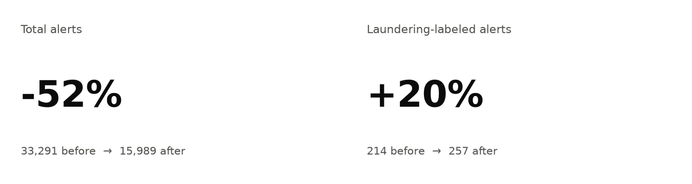
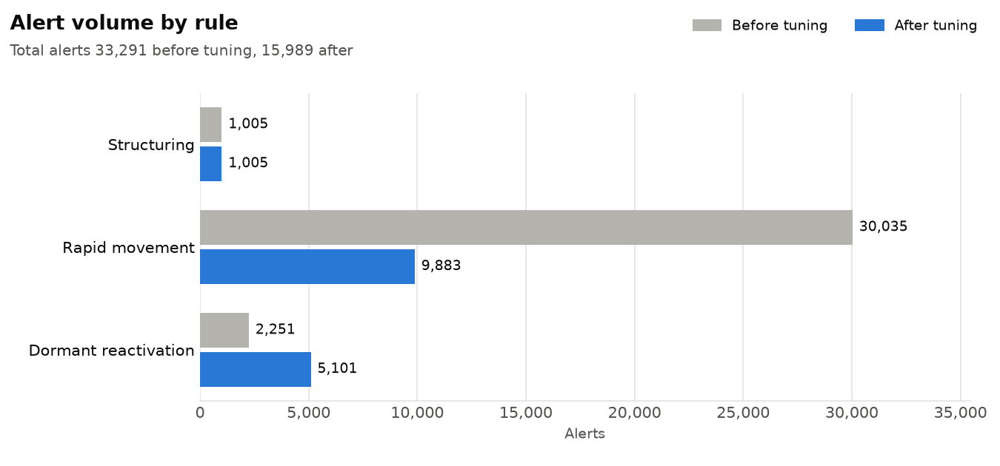
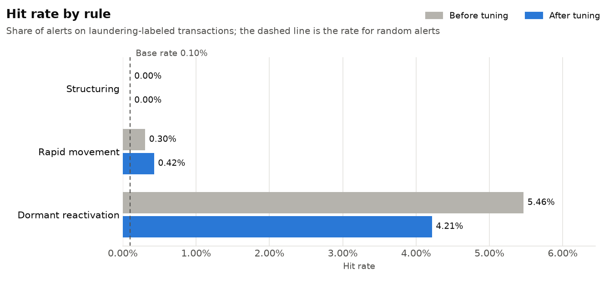

# AML Transaction Monitoring Sandbox

An end-to-end anti-money laundering (AML) monitoring workflow built on 5 million synthetic bank transactions: data quality validation, SQL detection rules, threshold tuning against labeled outcomes, and results reporting.



Tuning cut total alerts by 52% while increasing the number of alerts on laundering-labeled transactions by 20%.

## Why this project

Transaction monitoring programs face a constant trade-off: rules that catch more suspicious activity also generate more false positives, and every alert costs investigator time. This project works through that trade-off the way a monitoring team would, with documented decisions at each step.

## Workflow

1. **Select and document the data.** Chose the IBM synthetic AML dataset over PaySim because it includes real timestamps, bank accounts, and payment formats. See [docs/dataset.md](docs/dataset.md).
2. **Validate data quality.** Checked schema, nulls, duplicates, amounts, timestamps, and labels before running any rules. See [reports/data_quality_report.md](reports/data_quality_report.md).
3. **Detect.** Wrote three SQL rules for common money laundering typologies. See [docs/detection_rules.md](docs/detection_rules.md).
4. **Measure and tune.** Scored each rule against the dataset's laundering labels and tested 15 threshold combinations. See [reports/tuning_results.md](reports/tuning_results.md).
5. **Report.** Generated before-and-after charts and a comparison table from code. See [reports/before_after.md](reports/before_after.md).

Planning and decisions are tracked in this repo's [Issues](../../issues), with one issue per stage under a parent epic.

## Data

- **Source:** [IBM Transactions for Anti Money Laundering](https://www.kaggle.com/datasets/ealtman2019/ibm-transactions-for-anti-money-laundering-aml), file HI-Small_Trans.csv
- **Size:** 5,078,345 transactions covering September 1 to 18, 2022
- **Labels:** 5,177 transactions (0.10%) are labeled as laundering
- **Quality:** No nulls, invalid amounts, unparseable timestamps, or invalid labels. Nine exact duplicate rows were found; because timestamps are recorded to the minute, these are plausibly legitimate repeat payments, so they were kept and documented.

## Detection rules

| Rule | Typology | Logic |
|---|---|---|
| Structuring | Splitting cash to avoid the $10,000 reporting threshold | Repeated cash payments between $9,000 and $10,000 from one account within 7 days |
| Rapid movement | Pass-through or mule accounts | Funds sent out within hours of being received, at 95 to 100% of the amount received |
| Dormant reactivation | Account takeover or purchased accounts | A large payment after a period of no activity |

The rules are written in SQL against a local SQLite database, using window functions, `LAG`, and an indexed as-of join.

## Results





| Rule | Alerts before | Alerts after | Laundering hits before | Laundering hits after | Hit rate after |
|---|---:|---:|---:|---:|---:|
| Structuring | 1,005 | 1,005 | 0 | 0 | 0.00% |
| Rapid movement | 30,035 | 9,883 | 91 | 42 | 0.42% |
| Dormant reactivation | 2,251 | 5,101 | 123 | 215 | 4.21% |
| **Total** | **33,291** | **15,989** | **214** | **257** | |

**Hit rate** is the share of a rule's alerts that land on laundering-labeled transactions. For comparison, a random transaction has a 0.10% chance of being laundering.

## Key findings

- **Dormant reactivation is the strongest rule.** Its alerts are about 40 times more likely to be laundering than a random transaction. Shortening the dormancy gap from 5 to 3 days caught 75% more laundering.
- **Rapid movement was mostly noise.** At baseline it produced about 330 alerts per laundering hit. Tightening the window from 24 to 12 hours and the amount ratio from 90% to 95% removed about 20,000 alerts. It also lost about half its hits, a trade-off accepted because the removed alerts were overwhelmingly false positives.
- **Structuring found no laundering, and that is a finding.** The dataset's laundering is generated from network patterns such as fan-in, fan-out, and cycles between accounts, not cash structuring. The rule is kept as a control, which shows the importance of checking that rules match the typologies present in the data.
- **Tuning favored detection over minimum volume.** Missed laundering is usually the larger regulatory risk, so settings that caught more laundering were preferred even where they added alerts.

## How to run

Requires Python 3.10 or later. Commands below use `py` (Windows); use `python3` on macOS or Linux.

```
py -m pip install -r requirements.txt
```

1. Download HI-Small_Trans.csv from the source above and place it in a `data/` folder.
2. Run the pipeline from the repo root:

```
py scripts/data_quality.py      # data quality report
py scripts/load_db.py           # load the CSV into data/aml.db (about 1 minute)
py scripts/run_rules.py         # run the rules with the tuned thresholds
py scripts/tune_rules.py        # optional: rerun the threshold tests (10 to 15 minutes)
py scripts/build_dashboard.py   # before and after charts and table (about 5 minutes)
```

The data, database, and alert files stay local and are excluded by `.gitignore`.

## Repository structure

```
docs/       dataset documentation and detection rule logic
sql/        one SQL file per detection rule
scripts/    Python scripts for each stage of the pipeline
reports/    generated reports and figures
```

## Limitations

- **Synthetic data.** Patterns may not match real-world laundering, and labels are known with certainty, which real programs never have.
- **Short date range.** The 18-day window required a dormancy gap in days rather than the 90 or more days typical in practice.
- **Transaction-level alerts.** Production systems usually roll alerts up into account-level cases for investigators.
- **Tuning on labeled outcomes.** Thresholds were tuned and evaluated on the same data. A production approach would hold out a separate period for validation.

## Tools

Python (pandas, matplotlib), SQL (SQLite), Git and GitHub Issues
